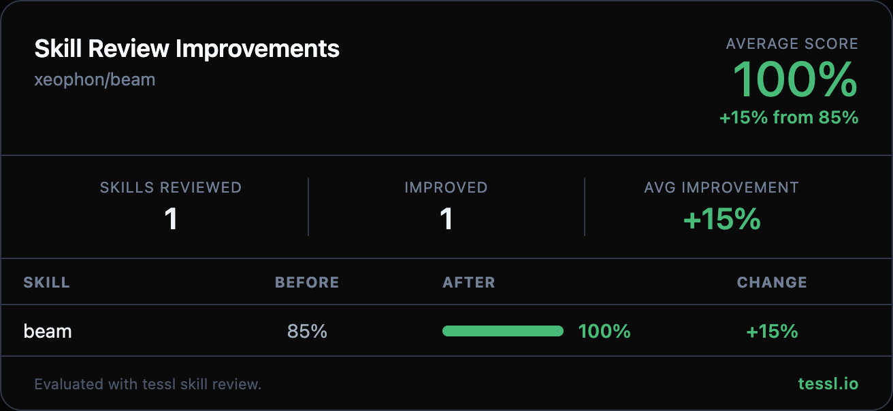

Hey 👋 @xeophon

I ran your skills through `tessl skill review` at work and found some targeted improvements. Here's the full before/after:

| Skill | Before | After | Change |
|-------|--------|-------|--------|
| beam | 85% | 100% | +15% |

Changes made

- Expanded frontmatter description with specific concrete actions (provisioning pods, rsyncing project, syncing CLI auth/state) and natural trigger terms (`remote server`, `SSH`, `cloud GPU instance`, `migrate session`)
- Added explicit "Use when..." clause covering three user scenarios
- Clarified goal section with actual commands and behaviors (e.g. `prime pods create`, npm installs, `--skip-auth` behavior)
- Expanded execution checklist with pre-validation steps (`prime whoami` failure path, `rsync`/`ssh` availability check), expected output format (`=== Prime Handoff Complete ===`), and a pod termination reminder

Honest disclosure — I work at @tesslio where we build tooling around skills like these. Not a pitch - just saw room for improvement and wanted to contribute.

Want to self-improve your skills? Just point your agent (Claude Code, Codex, etc.) at [this Tessl guide](https://docs.tessl.io/evaluate/optimize-a-skill-using-best-practices) and ask it to optimize your skill. Ping me - [@yogesh-tessl](https://github.com/yogesh-tessl) - if you hit any snags.

Thanks in advance 🙏
